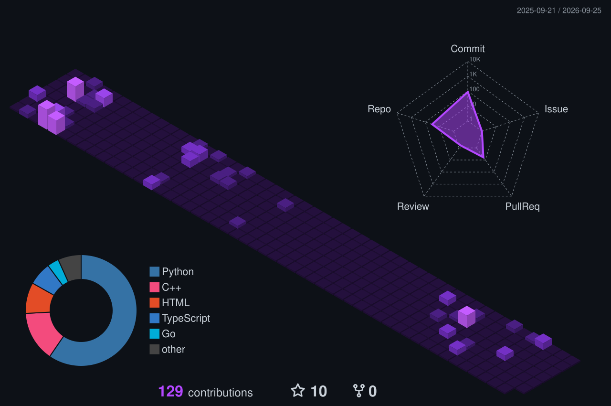

<!--
  Profile README for: https://github.com/preatady
  Designed to use only GitHub-compatible HTML/Markdown and public image services.
-->


<div align="center">


<br>

<a href="https://github.com/preatady">
  
</a>
<a href="https://github.com/preatady/dat-portfolio">
  
</a>


</div>

---

## 👨‍💻 Developer Console

<table>
  <tr>
    <td width="52%" valign="top">

```yaml
name: Đạt Nguyễn
role: AI Student
location: Vietnam

building:
  - AI-powered desktop tools
  - OCR and video automation
  - TTS and subtitle workflows
  - Agent-based developer systems

learning:
  - Machine Learning
  - Deep Learning
  - Computer Vision
  - RAG and AI Agents
  - System reliability
```

</td>
<td width="48%" valign="top">

### ⚡ Current Mode

- 🎓 Artificial Intelligence student
- 🐍 Python-first developer
- 🧠 Practical AI over demo-only AI
- 🧩 Interested in context engineering
- 🛠️ Learning through real projects
- 🚀 Preparing for hackathons and AI roles

> Build useful systems, understand the fundamentals, then optimize.

</td>
  </tr>
</table>

---

## 🎯 Current Focus

<div align="center">

<table>
  <tr>
    <td align="center" width="33%">
      <h3>🤖 AI Engineering</h3>
      
      <p>Turning AI ideas into usable applications.</p>
    </td>
    <td align="center" width="33%">
      <h3>🐍 Python Systems</h3>
      
      <p>Desktop apps, services, automation, and tooling.</p>
    </td>
    <td align="center" width="33%">
      <h3>👁️ Computer Vision</h3>
      
      <p>OCR pipelines, OpenCV, and video processing.</p>
    </td>
  </tr>
  <tr>
    <td align="center" width="33%">
      <h3>🧠 AI Agents</h3>
      
      <p>Context, memory, tools, and reliable execution.</p>
    </td>
    <td align="center" width="33%">
      <h3>⚙️ Automation</h3>
      
      <p>Repeatable pipelines that save real time.</p>
    </td>
    <td align="center" width="33%">
      <h3>🧪 Reliability</h3>
      
      <p>Safer changes, faster apps, fewer regressions.</p>
    </td>
  </tr>
</table>

</div>

---

## 🧰 Technology Interface

<div align="center">

### Core Languages


### AI, Data & Vision


<br><br>

&nbsp;&nbsp;

&nbsp;&nbsp;


### Development, Automation & Infrastructure


<br><br>

&nbsp;&nbsp;

&nbsp;&nbsp;


### Models, Agents & LLM Tooling


&nbsp;&nbsp;

&nbsp;&nbsp;

&nbsp;&nbsp;

&nbsp;&nbsp;


</div>

---

## 🚀 Featured Projects

<div align="center">

<table>
  <tr>
    <td width="50%">
      <a href="https://github.com/preatady/Subtitle-OCR">
        
      </a>
    </td>
    <td width="50%">
      <a href="https://github.com/preatady/Ai-Agent-Skill">
        
      </a>
    </td>
  </tr>
  <tr>
    <td width="50%">
      <a href="https://github.com/preatady/hand_ai_draw">
        
      </a>
    </td>
    <td width="50%">
      <a href="https://github.com/preatady/Ai-web-search-chatbot">
        
      </a>
    </td>
  </tr>
</table>

</div>

---

## 📊 GitHub Command Center

<div align="center">

<table>
  <tr>
    <td>
      
    </td>
    <td>
      
    </td>
  </tr>
</table>


<br>


</div>

---

## 🗓️ 3D Contribution Timeline

<div align="center">
  
</div>

---

## 🧭 Learning Roadmap

<table>
  <tr>
    <td width="25%" align="center">
      <h3>01</h3>
      <b>Foundation</b>
      <br>
      Python · DSA · Git
    </td>
    <td width="25%" align="center">
      <h3>02</h3>
      <b>Applied AI</b>
      <br>
      ML · CV · NLP
    </td>
    <td width="25%" align="center">
      <h3>03</h3>
      <b>AI Systems</b>
      <br>
      Agents · RAG · APIs
    </td>
    <td width="25%" align="center">
      <h3>04</h3>
      <b>Production</b>
      <br>
      Tests · Performance · Deployment
    </td>
  </tr>
</table>

---

## 🏆 GitHub Achievements

<div align="center">
  
</div>

---

<div align="center">

### 🤝 Open to learning, building, and collaborating


</div>


